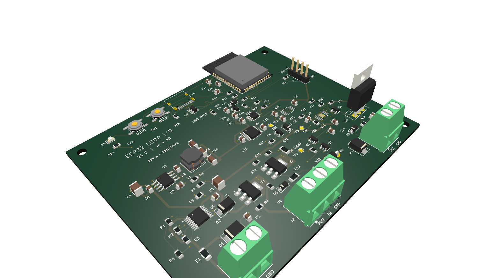

# Codex EE-design test, human foreword
So, background, i saw the Chatgpt Astra demo for kicad design and wanted to try it out myself, i just have an Open AI plus subscription, so i had to use the LOW setting to not nuke my usage immidiatly. But it managed to make this design within my three usage resets. Im pretty damn impressed with the result, its not perfect, but it is a fully routed design with no drc errors made in under 3 hours with a 20$ subscription. I would say the most lacking part is the schematic, it is not very human readable, but i do understand why it is made as it is as ive tried multiple MCP's for ee design and wires in schematics becomes a hot mess with more than a few components. But now im out of resets so i thought i stop here. 

Initial repo: [my kicad template](https://github.com/fredriknk/kicad_template)
Initial promt: [prompt](https://github.com/fredriknk/chatgpt_astra_test2/blob/main/Prompt.md)

After the initial prompt i basically just said "Sounds like a good idea" to any questions

# ESP32 24 V current-loop interface - Rev A

A 100 x 80 mm, four-layer prototype with an ESP32-S3, one protected 4-20 mA input, and one sourcing 4-20 mA output. Power and signal grounds are shared; this is not an isolated interface.



The layout is fully routed. Final KiCad 9 checks report **zero ERC violations, zero DRC violations, zero unconnected items, and zero schematic/PCB parity errors**. The independent connectivity check covers 93 components and 273 connected pins. Hardware accuracy, fault survival, thermal performance, EMC and USB interoperability still require prototype testing.

| Start here | Contents |
|---|---|
| [Design and bring-up guide](DOCUMENTATION/DESIGN.md) | Wiring, protection, firmware interface, calibration and bench tests |
| [Fabrication notes](DOCUMENTATION/FABRICATION.md) | Stackup, USB impedance, assembly and procurement |
| [KiCad project](CAD/chatgpt_astra_test2/chatgpt_astra_test2.kicad_pro) | Editable schematic and PCB, with local libraries |
| [Schematic PDF](DOCUMENTATION/chatgpt_astra_test2_schematic.pdf) | Five schematic sheets |
| [Board layers PDF](DOCUMENTATION/chatgpt_astra_test2_board_prints.pdf) | Copper, mask, silkscreen and assembly views |
| [Layout verification](DOCUMENTATION/board_review/README.md) | Checks, USB length audit and milestones |
| [Manufacturing outputs](PRODUCTION/20260907_1303_chatgpt_astra_test2/) | Four copper layers, masks, silk, paste, outline, drills, BOM and placement CSV |
| [CI build log](DOCUMENTATION/ci_build.log) | Successful complete output-pipeline run |

## Regenerate and check

On Windows with KiCad 9 installed, run `generate_outputs.bat`. The equivalent command is:

```text
python build_outputs.py --project CAD/chatgpt_astra_test2/chatgpt_astra_test2.kicad_pro --iso --zip
```

The script fails on ERC/DRC violations and generates a new timestamped production folder. It does not place an order. `generate_outputs.sh` provides the same entry point on systems with KiCad on PATH. Set `KICAD9_3DMODEL_DIR` to the installed KiCad model library if needed.

The BOM is an engineering BOM: semiconductor part numbers are in Value fields, while several passives retain value/rating specifications rather than purchasing MPNs. Review procurement before ordering. Three installed 3D models are missing (USB connector, DAC and current driver); their footprints are present, but the STEP/render is not a complete mechanical assembly model.
